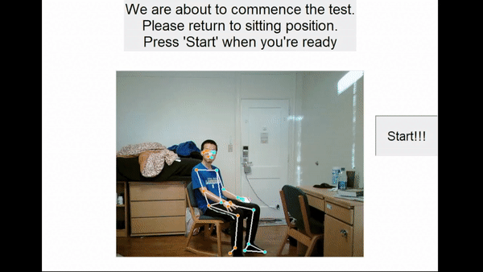

# BIM001.5 Fall Assessment

This repo is for project BIM001.5 Fall Assessment, which is a computer-vision-based elderly fall risk assessment method.

This project is adapted from the pose detection algorithm offered by [Mediapipe](https://google.github.io/mediapipe/solutions/pose_classification.html).

`fall-assessment-integrated.py` runs a demo interface, and `notebook-fall-assessment-software-only.ipynb` is a simplified version of it. 

See detailed description [here](https://zhouchengyang.com/2022/01/12/BIM001-5FallAssessment/)

